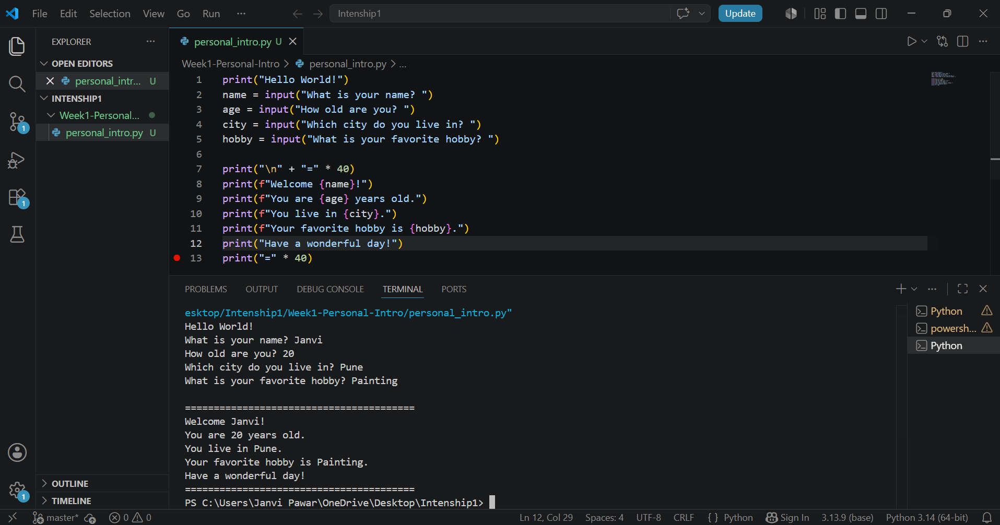

## Overview
This project is a beginner Python program that collects user information and displays a personalized message.

## What I Learned
- Variables and data types
- Taking input using input()
- Using print() and f-strings
- Basic Python syntax

## How to Run
1. Install Python.
2. Download or clone this repository.
3. Open a terminal in the project folder.
4. Run: python personal_intro.py

## Project Structure

```
Week1/
├── README.md
├── personal_intro.py
├── requirements.txt
└── Screenshot1.png
```

## Output



## Technical Details

* Uses Python `input()` to collect user information.
* Stores data using variables.
* Uses f-strings and `print()` to display output.
* No external libraries are required.

## Testing Evidence

### Test Case

**Input:**

* Name: Janvi
* Age: 19
* City: Pune
* Hobby: Painting

**Expected Output:**
A personalized welcome message displaying the entered information.

**Result:** Passed ✅

